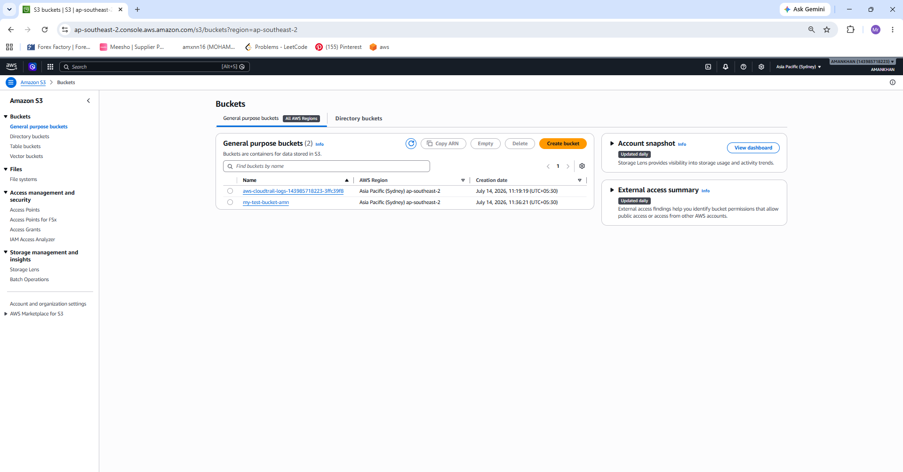
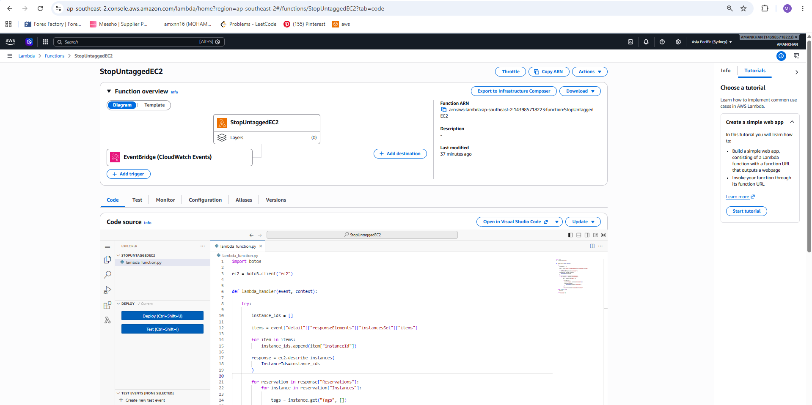
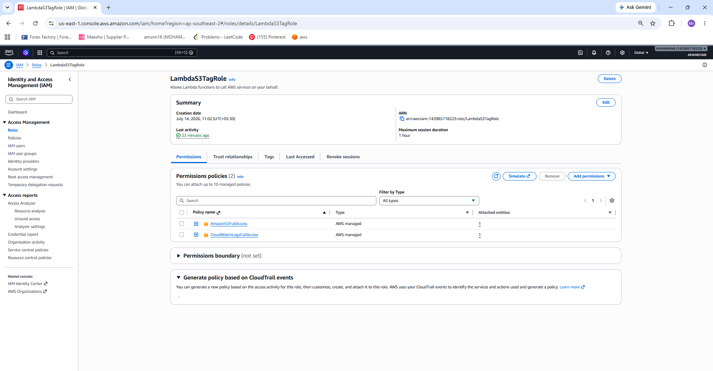
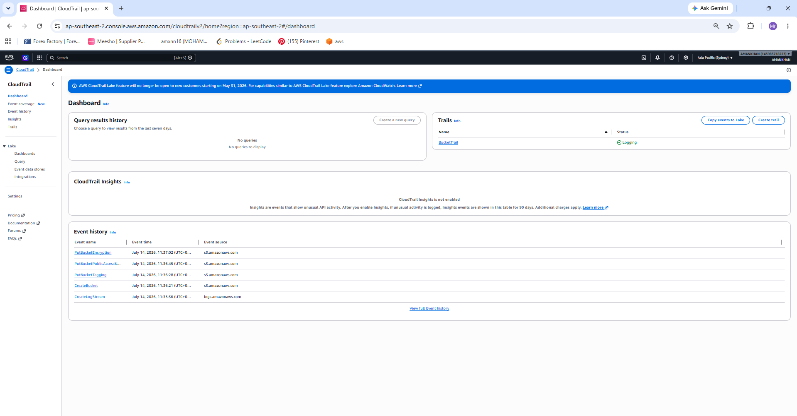
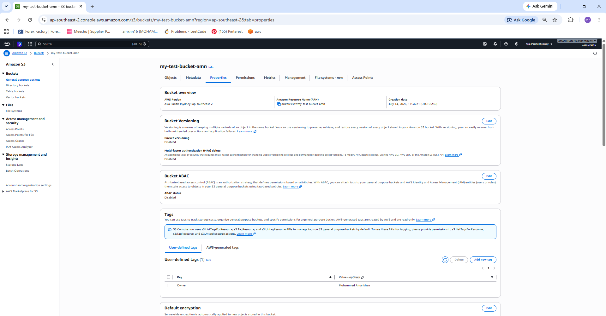

# 🏷️ AWS Lambda - Automatic S3 Bucket Tagging


## 📌 Project Overview

This project automatically detects when a new Amazon S3 bucket is created and immediately adds a predefined tag to that bucket using an AWS Lambda function.

Whenever a new bucket is created:

- CloudTrail records the API event.
- EventBridge detects the CloudTrail event.
- AWS Lambda is triggered automatically.
- Lambda adds the following tag to the bucket:

| Key | Value |
|------|-------|
| Owner | owner name |

This automation removes manual work and helps maintain consistent resource tagging across AWS environments.

---

# 🏗️ Architecture

```
User Creates S3 Bucket
          │
          ▼
 AWS CloudTrail Logs Event
          │
          ▼
 Amazon EventBridge Rule
          │
          ▼
 AWS Lambda Function
          │
          ▼
Adds Tag:
Owner = owner name
```

---

# 🚀 Technologies Used

- AWS Lambda
- Amazon S3
- AWS CloudTrail
- Amazon EventBridge
- AWS IAM
- Python (Boto3)

---

# 📂 Project Structure

```
lambda-s3-auto-tagging/
│
├── lambda_function.py
├── README.md
└── screenshots/
    ├── CloudTrail.png
    ├── IAM-role.png
    ├── lambda-function.png
    ├── output-tag.png
    └── s3-buckets.png
```

---

# ⚙️ How It Works

## Step 1 - Create an S3 Bucket

Whenever a user creates a new S3 bucket, AWS records this API activity.

↓

## Step 2 - CloudTrail Records the Event

CloudTrail captures the **CreateBucket** API call.

↓

## Step 3 - EventBridge Detects the Event

An EventBridge rule listens for the CloudTrail CreateBucket event and automatically invokes the Lambda function.

↓

## Step 4 - Lambda Executes

The Lambda function receives the bucket name from the event.

Using the AWS SDK for Python (Boto3), it calls:

```python
put_bucket_tagging()
```

to attach the required tag.

↓

## Step 5 - Bucket Tagged Successfully

The bucket now contains:

```
Owner = owner name
```

without any manual action.

---

# 🔐 IAM Role

The Lambda function requires an IAM Role with permissions to:

- Read CloudTrail events
- Write CloudWatch Logs
- Tag Amazon S3 Buckets

Example permissions include:

- `s3:PutBucketTagging`
- `s3:GetBucketTagging`
- `logs:*`

---

# 🐍 Lambda Function

The Lambda function is written in **Python** using **Boto3**.

It performs the following tasks:

- Receives bucket creation event
- Extracts bucket name
- Creates the Owner tag
- Applies the tag to the bucket
- Logs success or failure in CloudWatch

---

# 📸 Screenshots

## S3 Buckets



---

## Lambda Function



---

## IAM Role



---

## CloudTrail Configuration



---

## Output (Bucket Tagged)



---

# 💡 Why This Project?

Managing hundreds of AWS resources manually is time-consuming.

Automatic tagging helps organizations:

- Improve resource organization
- Simplify cost allocation
- Enforce governance policies
- Track resource ownership
- Reduce manual configuration errors
- Maintain compliance standards

---

# ✅ Features

- Automatically detects S3 bucket creation
- Event-driven architecture
- No manual intervention
- Python-based Lambda function
- CloudTrail event monitoring
- EventBridge integration
- Automatic Owner tag assignment
- Easily customizable tag values

---

# ▶️ How to Deploy

1. Create an IAM Role with S3 tagging permissions.
2. Create the Lambda Function.
3. Upload the Python code.
4. Enable AWS CloudTrail.
5. Create an EventBridge Rule for the **CreateBucket** event.
6. Connect the rule to the Lambda function.
7. Create a new S3 bucket.
8. Verify that the **Owner** tag has been added automatically.

---

# 📚 Learning Outcomes

Through this project, I learned:

- AWS Lambda
- Event-driven architecture
- Amazon EventBridge
- AWS CloudTrail
- IAM Roles and Permissions
- Amazon S3
- Python Boto3 SDK
- AWS Resource Tagging

---

# 👨‍💻 Author

## **MOHAMMED AMANKHAN**

Computer Science Engineer

AWS Cloud | Python | DevOps Enthusiast

GitHub: **https://github.com/yourusername**

---

# 📄 License

This project is licensed under the **MIT License**.

Feel free to use, modify, and distribute this project for learning and educational purposes.

---

⭐ If you found this project useful, consider giving it a **Star** on GitHub!
